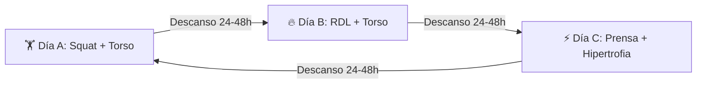

# 🏋️‍♂️ GUÍA MAESTRA DE ENTRENAMIENTO Y NUTRICIÓN VIGOREXIAPP

---

## 📋 Resumen del Ecosistema de Entrenamiento

VigorexiApp integra dos sistemas de entrenamiento de máxima evidencia científica para hipertrofia y ganancia de fuerza, seleccionables en la app móvil y en el reloj:

1. **⚡ PROGRAMA PRINCIPAL: FULL BODY CÍCLICO ROTATIVO (3 DÍAS)**
   * **Enfoque:** Máxima hipertrofia con **gestión óptima de fatiga en piernas**. Solo 1 ejercicio de pierna por sesión (3 series).
   * **Duración:** **48 a 54 minutos** por sesión (con descansos pesados de 120-150 s y biseries de brazos y accesorios).
   * **Intensidad:** RIR 1-2 (a 1 o 2 repeticiones del fallo técnico).
   * **Frecuencia óptima:** **Patrón 1 ON - 1 OFF continuo** (Día entreno - Día descanso de forma infinita).
2. **📋 PROGRAMA ALTERNATIVO: TORSO / PIERNA (4 DÍAS)**
   * **Enfoque:** Distribución clásica con 2 días de torso y 2 días de pierna.
   * **Frecuencia:** Lunes - Martes - Jueves - Viernes.

---

## ⏱️ Protocolo de Calentamiento y Aproximación

> [!IMPORTANT]
> **Las series de aproximación NO cuentan como series efectivas.** Su único objetivo es lubricar articulaciones y preparar el sistema nervioso sin generar fatiga muscular ni acumulación de lactato.

### Protocolo para el 1er gran básico del día (Sentadilla, Banca, RDL, Press Militar):

| Fase | Carga aprox. | Repeticiones | Descanso |
| :--- | :---: | :---: | :---: |
| **Fase 1 (Muy ligera)** | Barra sola / ~40% | 8 - 10 | **30 - 45 s** *(lo que tardas en poner discos)* |
| **Fase 2 (Media)** | ~60% - 70% | 3 - 5 | **60 - 90 s** |
| **Fase 3 (Último toque)** | ~85% - 90% | 1 | **2 a 3 min completos** *(para reponer fosfocreatina)* |
| **➡️ SERIE 1 EFECTIVA** | **100% peso objetivo** | **Reps objetivo** | **Descanso oficial de la rutina** |

*Para los ejercicios secundarios siguientes (poleas, máquinas), basta con 1 serie previa de tanteo (3-4 reps ligeras) para calibrar la máquina.*

---

## 📈 Sistema de Progresión: Doble Progresión Dinámica

1. **Fijar el peso:** Mantén el mismo peso en un ejercicio hasta que seas capaz de completar el **techo máximo de repeticiones en todas las series** con RIR 1-2.
   * *Ejemplo en Sentadilla (3 × 6-8 con 100 kg):*
     * Sesión 1: 8, 7, 6 reps con 100 kg. *(Mantienes 100 kg)*
     * Sesión 2: 8, 8, 7 reps con 100 kg. *(Mantienes 100 kg)*
     * Sesión 3: 8, 8, 8 reps con 100 kg. *(¡Objetivo cumplido!)*
2. **Subida de carga:** En la siguiente sesión, añade el salto mínimo disponible (**+2.5 kg a +5 kg en básicos**, o **+1 kg a +2 kg en aislamiento**) y vuelve a la base del rango (6 reps).

---

# ⚡ PROGRAMA 1: FULL BODY CÍCLICO ROTATIVO (3 DÍAS)
*Diseñado para resolver la pesadez de piernas y maximizar la recuperación (48-54 min).*

### 🗓️ DÍA A: Sentadilla Pesada + Empuje & Tirón Horizontal
*Duración estimada: **50 - 54 minutos** | Total: 17 series*

| # | Ejercicio | Series × Reps | Carga Ref. | RIR | Descanso |
| :-: | :--- | :---: | :---: | :---: | :---: |
| **1** | **Sentadilla trasera con barra (Back Squat)** | 3 × 6-8 | 100 kg | 1-2 | 120 - 150 s *(Fuerza Cuádriceps)* |
| **2** | **Press de banca plano con barra** | 4 × 6-8 | 80 kg | 1-2 | 120 s *(Prioridad Pecho)* |
| **3** | **Jalón al pecho prono (agarre ancho)** | 4 × 8-10 | 70 kg | 1-2 | 90 s *(Prioridad Dorsal)* |
| **4** | **Elevaciones laterales con mancuernas** | 3 × 12-15 | 12 kg | 1 | 60 s *(Deltoide Lateral)* |
| **5a** | **Extensión de tríceps en polea alta** | 3 × 10-12 | 30 kg | 1 | **⚡ 45 s (Biserie con Bíceps)** |
| **5b** | **Curl de bíceps con mancuernas (supinación)**| 3 × 10-12 | 16 kg | 1 | **⚡ 45 s (Biserie con Tríceps)** |

*Alternativas:*
* *Sentadilla trasera:* Sentadilla Hack en máquina | Prensa 45° | Sentadilla en Multipower.
* *Press banca plano:* Press con mancuernas en banco plano | Press plano en máquina convergente.
* *Jalón al pecho:* Dominadas asistidas o libres | Jalón unilateral en polea alta.

---

### 🗓️ DÍA B: Bisagra Cadera (RDL) + Inclinado & Tracción Dorsal
*Duración estimada: **48 - 52 minutos** | Total: 17 series*

| # | Ejercicio | Series × Reps | Carga Ref. | RIR | Descanso |
| :-: | :--- | :---: | :---: | :---: | :---: |
| **1** | **Peso Muerto Rumano (RDL) con barra** | 3 × 8-10 | 90 kg | 1-2 | 120 - 150 s *(Cadena Posterior/Isquios)* |
| **2** | **Press inclinado con mancuernas (30°)** | 4 × 8-10 | 30 kg | 1-2 | 90 - 120 s *(Haz Clavicular Pecho)* |
| **3** | **Remo unilateral con mancuerna (o máquina)**| 4 × 8-10 | 34 kg | 1-2 | 90 s *(Dorsal y Densidad)* |
| **4** | **Press militar sentado con mancuernas** | 3 × 8-10 | 24 kg | 1-2 | 90 s *(Hombro Anterior/Deltoides)* |
| **5a** | **Face Pull en polea alta** | 3 × 12-15 | 25 kg | 1 | **⚡ 45 s (Biserie con Plancha)** |
| **5b** | **Plancha abdominal isométrica en suelo** | 3 × 50-60 s | — | — | **⚡ 45 s (Biserie con Face Pull)** |

*Alternativas:*
* *RDL barra:* RDL con mancuernas pesadas | RDL en Multipower | Hip Thrust con barra.
* *Press inclinado:* Press inclinado en máquina | Press inclinado en Multipower.
* *Remo unilateral:* Remo en polea baja agarre neutro | Remo en máquina con apoyo en pecho.

---

### 🗓️ DÍA C: Prensa/Búlgara + Hipertrofia Torso & Brazos
*Duración estimada: **50 - 54 minutos** | Total: 18 series*

| # | Ejercicio | Series × Reps | Carga Ref. | RIR | Descanso |
| :-: | :--- | :---: | :---: | :---: | :---: |
| **1** | **Prensa de piernas 45° (o Sentadilla Búlgara)** | 3 × 8-10 | Carga alta | 1-2 | 90 s *(Pierna Dinámica)* |
| **2** | **Curl femoral tumbado o sentado** | 3 × 10-12 | 50 kg | 1-2 | 75 s *(Aislamiento Isquiotibiales)* |
| **3** | **Jalón al pecho con agarre neutro cerrado** | 4 × 8-10 | 70 kg | 1-2 | 90 s *(Amplitud Dorsal)* |
| **4** | **Elevaciones laterales en polea** | 3 × 12-15 | 10 kg | 1 | 60 s *(Tensión Continua Hombro)* |
| **5a** | **Press francés con mancuernas o barra Z** | 3 × 10-12 | 32 kg | 1 | **⚡ 45 s (Biserie con Martillo)** |
| **5b** | **Curl martillo con mancuernas** | 3 × 10-12 | 16 kg | 1 | **⚡ 45 s (Biserie con Francés)** |
| **6** | **Crunch en polea alta arrodillado** | 3 × 12-15 | 40 kg | 1 | 60 s *(Recto Abdominal)* |

*Alternativas:*
* *Prensa 45°:* Sentadilla búlgara con mancuernas (20 kg) | Sentadilla Goblet profunda.
* *Curl femoral:* Curl femoral unilateral de pie | Curl nórdico asistido.
* *Crunch polea:* Rueda abdominal | Elevación de piernas colgado.

---

# 📋 PROGRAMA 2: TORSO / PIERNA CLÁSICO (4 DÍAS)
*Para periodos donde prefieras separar 100% tren superior y tren inferior.*

### DÍA 1: LUNES – TORSO A (Empuje)
1. Press de banca plano barra: $4 \times 6\text{--}8$ (80 kg) | 120-150 s
2. Jalón al pecho prono ancho: $4 \times 8\text{--}10$ (70 kg) | 90-120 s
3. Press militar sentado mancuernas: $3 \times 8\text{--}10$ (24 kg) | 90 s
4. Remo en polea baja neutro: $3 \times 10\text{--}12$ (65 kg) | 90 s
5. Elevaciones laterales mancuernas: $3 \times 12\text{--}15$ (12 kg) | 75 s
6. Biserie Brazos (Extensión tríceps $3 \times 10\text{--}12$ + Curl bíceps $3 \times 10\text{--}12$) | 45 s

### DÍA 2: MARTES – PIERNA A (Cuádriceps)
1. Sentadilla trasera con barra: $3 \times 6\text{--}8$ (100 kg) | 150-180 s
2. Extensiones de cuádriceps en máquina: $3 \times 10\text{--}12$ (60 kg) | 90 s
3. Curl femoral tumbado: $3 \times 10\text{--}12$ (45 kg) | 90 s
4. Elevación de talones de pie: $3 \times 12\text{--}15$ (70 kg) | 60 s
5. Plancha abdominal isométrica: $3 \times 45\text{--}60\text{ s}$ | 45 s

### DÍA 3: JUEVES – TORSO B (Tracción)
1. Remo unilateral con mancuerna: $4 \times 8\text{--}10$ (34 kg) | 90-120 s
2. Press inclinado mancuernas: $4 \times 8\text{--}10$ (30 kg) | 90-120 s
3. Jalón neutro cerrado: $4 \times 8\text{--}10$ (70 kg) | 90-120 s
4. Elevaciones laterales polea: $3 \times 12\text{--}15$ (10 kg) | 75 s
5. Face pull en polea alta: $3 \times 12\text{--}15$ (25 kg) | 60 s
6. Biserie Brazos (Press francés $3 \times 10\text{--}12$ + Curl martillo $3 \times 10\text{--}12$) | 45 s

### DÍA 4: VIERNES – PIERNA B (Isquios & Cadena Posterior)
1. Peso Muerto Rumano (RDL): $3 \times 8\text{--}10$ (90 kg) | 120-150 s
2. Sentadilla búlgara con mancuernas: $3 \times 8\text{--}10$ / pierna (20 kg) | 90 s
3. Curl femoral sentado: $3 \times 10\text{--}12$ (55 kg) | 90 s
4. Extensiones de cuádriceps: $3 \times 12\text{--}15$ (55 kg) | 75 s
5. Elevación de talones sentado: $3 \times 12\text{--}15$ (45 kg) | 60 s
6. Crunch en polea alta: $3 \times 12\text{--}15$ (40 kg) | 60 s

---

# 🥗 GUÍA NUTRICIONAL Y FISIOLÓGICA PERSONALIZADA (DANI)

### 📊 Diagnóstico y Objetivos
* **Edad:** 39 años | **Altura:** 173 cm | **Peso:** 72 kg | **Tasa Metabólica Basal:** $1.610 \text{ kcal}$
* **Objetivo:** **Recomposición Corporal Estética.** Eliminar grasa acumulada en el abdomen sin perder masa magra ni fuerza, aumentando la definición muscular y la vascularización.

### 🔢 Números Diarios Clave
* **Calorías Objetivo:** **$\mathbf{1.850\text{ a }1.900\text{ kcal/día}}$** (Déficit controlado del 15%).
* **Proteína:** **$150\text{ g/día}$** ($2.1\text{ g/kg}$) $\rightarrow$ Preservación muscular máxima y saciedad.
* **Grasas Saludables:** **$60\text{ g/día}$** ($0.85\text{ g/kg}$) $\rightarrow$ Soporte de testosterona y salud articular.
* **Carbohidratos:** **$175\text{ g/día}$** ($2.4\text{ g/kg}$) $\rightarrow$ Glucógeno muscular y fuerza en los básicos.
* **Creatina Monohidrato:** **5 g diarios fijos** todos los días (con o sin entreno).

### ⏰ Distribución Peri-Entreno para las 15:15
1. **13:00 (Comida Ligera Pre-Entreno):**
   * Pollo/pavo a la plancha (100 g) o atún al natural + 50-60 g de arroz blanco o 200 g de patata cocida + verduras ligeras al vapor.
   * *Baja en grasa para permitir vaciado gástrico rápido en 2 horas.*
2. **15:15 (Entrenamiento Full Body - 50 min):**
   * Agua abundante (750 ml). Opcional: café solo 40 min antes de salir de la oficina.
3. **17:30 - 18:00 (Merienda Fuerte Post-Entreno):**
   * Batido de proteína Whey (30 g) + 5 g de creatina monohidrato + 1 plátano maduro o tortitas de avena.
   * Cena temprana nutritiva: pescado azul (salmón o merluza), ensalada completa y huevo.
4. **19:00 a 08:00 (Ventana de Ayuno Nocturno - 13-14 horas):**
   * Infusiones (manzanilla, menta poleo), agua. Estimula la sensibilidad a la insulina y la oxidación de ácidos grasos durante el sueño.

---

## 💤 Ritmo Óptimo de Entrenamiento y Descanso: "1 ON - 1 OFF"

Suponiendo total libertad de horarios, el régimen biológicamente más óptimo para una rutina Full Body de alta intensidad es entrenar **Día Sí, Día No**:

$$\text{Día A} \longrightarrow \text{Descanso} \longrightarrow \text{Día B} \longrightarrow \text{Descanso} \longrightarrow \text{Día C} \longrightarrow \text{Descanso} \longrightarrow \text{Día A...}$$

* **Ventaja 1:** Cada grupo muscular se estimula cada 48h, justo cuando la síntesis proteica vuelve al nivel basal, manteniéndote en constante estado anabólico.
* **Ventaja 2:** La columna vertebral y el sistema nervioso descansan 48h completas entre los 100 kg de sentadilla y los 90 kg de RDL, evitando dolores lumbares y sobrecargas articulares.
* **Ventaja 3:** En los días de descanso, caminar 8.000 - 10.000 pasos promueve la recuperación activa sin interferir con el crecimiento muscular.
